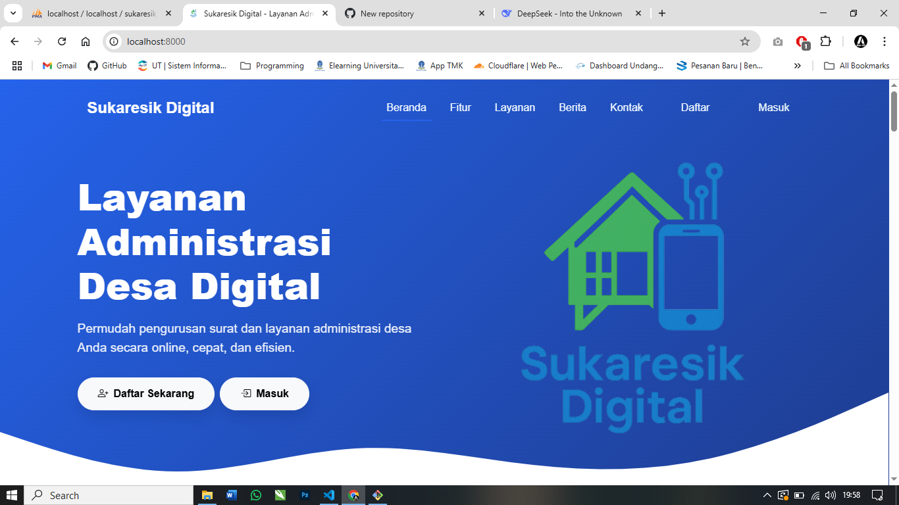

# Sukaresik Digital - Sistem Administrasi Desa Online



Sukaresik Digital adalah platform layanan administrasi desa online yang memudahkan warga dalam mengurus berbagai keperluan administrasi secara efisien dan transparan. Aplikasi ini dikembangkan untuk Desa Sukaresik sebagai solusi digital dalam pengurusan surat dan layanan administrasi desa.

## 🌟 Fitur Utama

- **Pengajuan Surat Online**: Warga dapat mengajukan berbagai jenis surat secara online tanpa perlu datang ke kantor desa
- **Tracking Status Pengajuan**: Pantau status pengajuan surat secara real-time
- **Notifikasi**: Dapatkan pemberitahuan tentang status pengajuan surat
- **Riwayat Pengajuan**: Lihat dan kelola riwayat pengajuan surat yang pernah dilakukan
- **Berita & Pengumuman**: Informasi terbaru dari desa
- **Dashboard Admin**: Pengelolaan data dan pengajuan surat oleh petugas desa

## 📋 Jenis Layanan

- Surat Keterangan Domisili
- Surat Pengantar KTP
- Surat Keterangan Tidak Mampu (SKTM)
- Surat Keterangan Usaha
- Surat Keterangan Kelahiran
- Surat Keterangan Kematian

## 💻 Teknologi yang Digunakan

**Frontend:**
- HTML5
- CSS3
- JavaScript (Vanilla)
- Bootstrap 5
- [AOS](https://michalsnik.github.io/aos/) (Animate On Scroll)
- [Swiper.js](https://swiperjs.com/)
- [Bootstrap Icons](https://icons.getbootstrap.com/)
- [SweetAlert2](https://sweetalert2.github.io/)
- [DataTables](https://datatables.net/)

**Backend:**
- PHP 8.2 (Native)
- MySQL 8.0

## ⚙️ Persyaratan Sistem

- PHP 7.4 atau lebih tinggi
- MySQL 5.7 atau lebih tinggi
- Web server (Apache/Nginx)
- Composer (untuk dependensi PHP)

## 🛠️ Instalasi

1. Clone repositori ini ke direktori web server Anda:

```bash
git clone https://github.com/aleaengineer/Sukaresik-Digital.git
cd Sukaresik-Digital
```

2. Install dependensi:

```bash
composer install
```

3. Import database dari file `database/database.sql`:

```bash
mysql -u username -p database < database/database.sql
```

4. Konfigurasi koneksi database di file `config/database.php`:

```php
<?php
$host = 'localhost';
$username = 'root';
$password = '';
$database = 'sukaresik-digital';

$conn = mysqli_connect($host, $username, $password, $database);

if (!$conn) {
    die("Koneksi database gagal: " . mysqli_connect_error());
}
?>
```

5. Setel izin untuk direktori uploads:

```bash
chmod -R 755 uploads/
```

6. Akses aplikasi melalui browser:

```
http://localhost/sukaresik-digital/
```

## 📂 Struktur Direktori

```
sukaresik-digital/
├── admin/                  # Halaman dan fungsi admin
├── assets/                 # File statis (CSS, JS, gambar)
│   ├── css/
│   ├── js/
│   ├── img/
│   └── fonts/
├── config/                 # File konfigurasi
├── includes/               # File PHP yang digunakan di beberapa halaman
├── uploads/                # Direktori untuk file yang diunggah
│   ├── dokumen/
│   ├── pengumuman/
│   └── profile/
├── database/               # File SQL untuk setup database
├── index.php               # Halaman utama
├── login.php               # Halaman login
├── register.php            # Halaman pendaftaran
├── dashboard.php           # Dashboard pengguna
├── pengajuan.php           # Form pengajuan surat
├── berita.php              # Halaman berita & pengumuman
└── README.md               # Dokumentasi
```

## 🔐 Akun Default

**Admin**
- Username: 123456789012345
- Password: password


*Segera ganti password default setelah login pertama!*

## 🤝 Kontribusi

Kontribusi untuk pengembangan aplikasi ini sangat diterima. Berikut cara berkontribusi:

1. Fork repositori ini
2. Buat branch fitur baru (`git checkout -b feature/fitur-baru`)
3. Commit perubahan Anda (`git commit -m 'Menambahkan fitur baru'`)
4. Push ke branch (`git push origin feature/fitur-baru`)
5. Buat Pull Request

## 📜 Lisensi

Proyek ini dilisensikan di bawah [MIT License](LICENSE).

## 📞 Kontak

Untuk pertanyaan atau dukungan, silakan hubungi:

- Email: admin@sukaresik.desa.id
- Website: [https://sukaresik.desa.id](https://sukaresik.desa.id)

---

Dikembangkan oleh **Alea Engineering** © 2025
```
